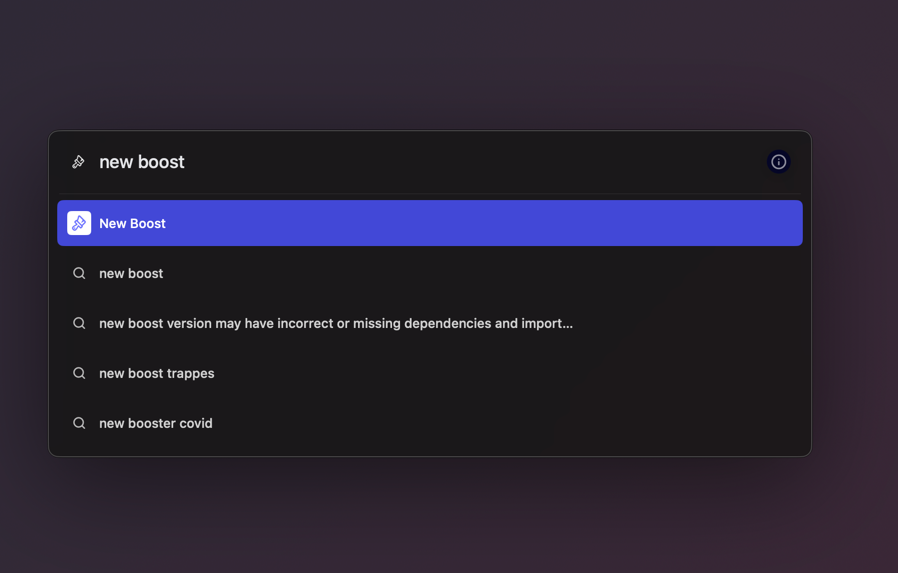
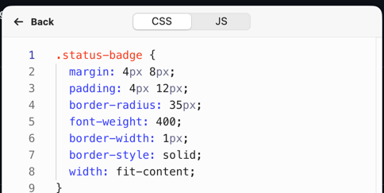
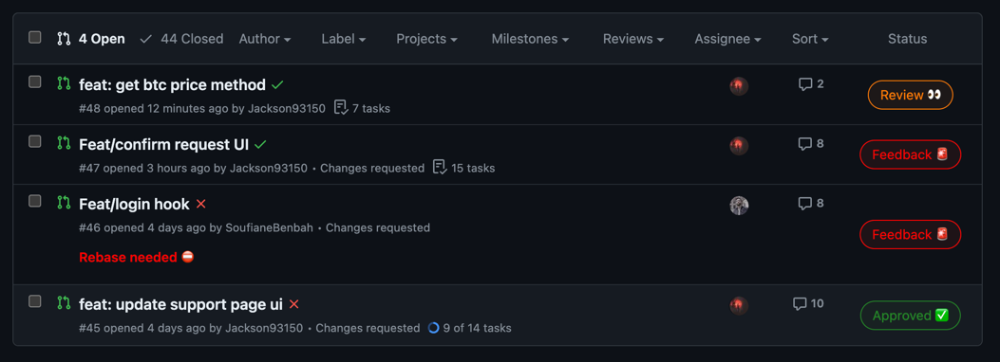

# GitHub Pull Request Status Stylizer

This script is a utility designed to enhance the visibility and status tracking of Pull Requests (PRs) on GitHub by adding custom badges directly in the PR list view. It identifies PRs that are in review, require feedback, are approved, or need a rebase, and then displays an appropriate status badge.

## Features

- **Status Badges:** Adds visual badges for quick identification of PR status.
- **Rebase Warnings:** Marks PRs that require rebasing.
- **Dynamic Updates:** Refreshes PR status badges as you navigate through GitHub PR lists without the need to reload the page.

## How to Use

1. In Arc, go to GitHub.com, press `CMD + T` and type `New Boost` 
1. Click on `Code` then Copy the [CSS File](./styles.css) and paste it in `CSS` panel, then copy [JS File](./script.js) and paste it in `JS` panel. 
2. Ensure you replace `const GITHUB_TOKEN = "";` with your personal GitHub token to authenticate API requests. 

## How to generate Your Personal GitHub Token

To authenticate API requests with your script, you will need a personal access token from GitHub. Follow these steps to create one:

1. **Access GitHub Settings:** Click on your profile picture in the top right corner of any GitHub page and select **Settings**.

2. **Navigate to Developer Settings:** On the left-hand side panel, scroll down and click on **Developer settings**.

3. **Personal Access Tokens:** From the side menu, select **Personal access tokens**.

4. **Generate New Token:** Press the **Generate new token** button to create a new token.

5. **Token Description:** Provide a meaningful description in the "Note" field, such as "Script Authentication Token," to identify the purpose of the token.

6. **Set Permissions:** Choose the scopes or permissions for the token. To operate correctly, the script needs access to public repositories, which includes reading pull requests. Select the scope that says `repo` or any other permissions required by your script.

7. **Generate Token:** Scroll down and click the **Generate token** button to create the token.

8. **Copy the Token:** Once the token is generated, copy it immediately and store it securely. GitHub will not show the token again for security reasons.

Remember, your GitHub token is like a password. Keep it confidential and never share it publicly.

## Contributing

Feel free to fork, submit issues, and send pull requests for improvements!

## License

[MIT](https://opensource.org/licenses/MIT)

Please remember to follow GitHub's API usage policies and respect privacy and rate limits.

